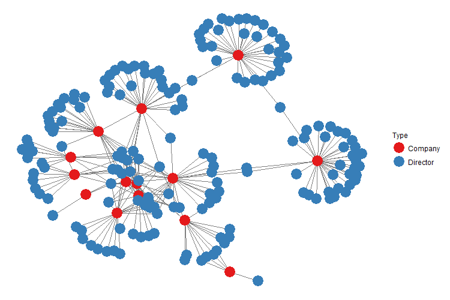
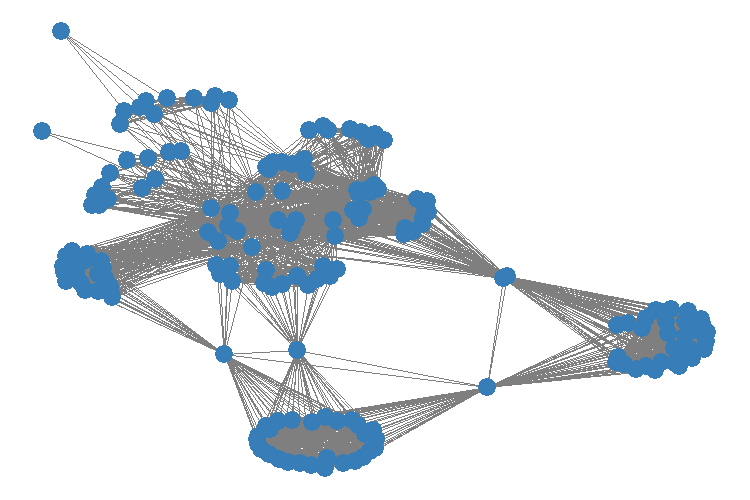
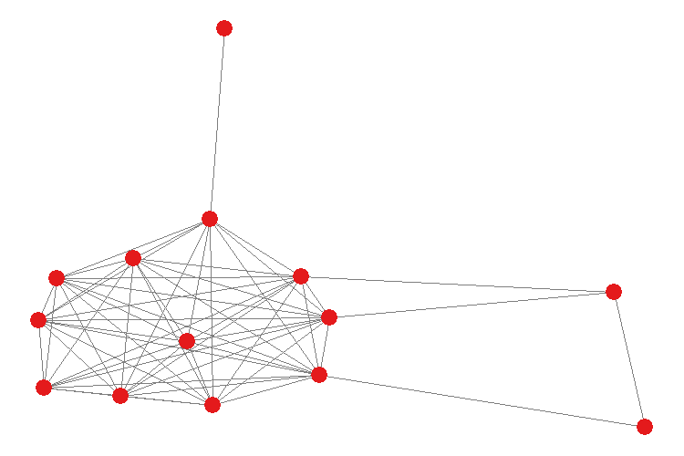
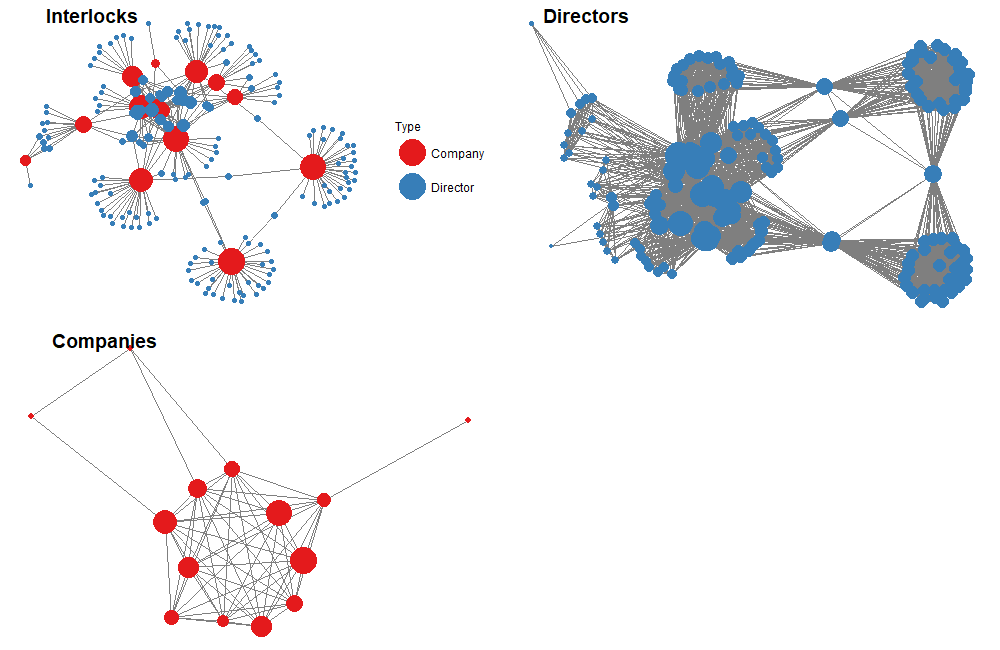
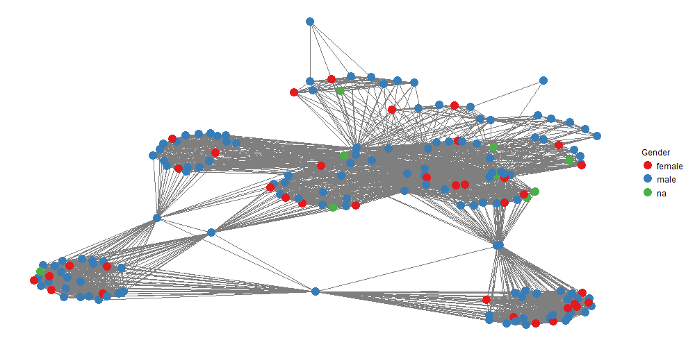

Companies House
================

NOTE: README TO BE UPDATED SOON - THERE HAVE BEEN CHANGES TO THE FUNCTION NAMES ETC. 

This is an R package aimed at helping in extracting data from companies house: <https://www.gov.uk/government/organisations/companies-house>

It particular, it provides a way to search for companies and extract a set of company numbers. These company numbers can then be used to identify company directors.

This package also provides functions which allow you to build a network of interlocking directors, that is a network of individuals and the companies, linked by board membership. Other networks are also created - such as director networks, this is a set of individuals linked by sitting on (at least one of) the same company board of directors. Company networks - a set of companies linked by having (at least one of) the same directors sitting on the board.

Packages
--------

This package requires a number of other packages, more specifically:

``` r
library(igraph)
library(tnet)
library(intergraph)
library(sna)
library(ggplot2)
library(GGally)
library(httr)
library(jsonlite)
library(ITNr)

#Install CompaniesHouse:
#library(devtools)
#devtools::install_github("MatthewSmith430/CompaniesHouse")
library(CompaniesHouse)
```

Authorisation Key
-----------------

To extract data from companies house (with the API), you will need to get an authorisation key.

The instructions on how to obtain your key can be found at: <https://developer.companieshouse.gov.uk/api/docs/index/gettingStarted/apikey_authorisation.html/>

When using the package, save your key as `mkey`:

``` r
mkey<-"ENTER YOUR AUTHORISATION KEY"
```

Company Search
--------------

The following function allows you to search for companies in Companies House (using the API). You use the search term with your authorisation key, and it returns a list of companies that match the search term. It also give the Companies House Company number, the company address and various other information. The company number is important, as it is used to identify the firm, and is used in many of the other package functions.

``` r
#Search for a "COMPANY SEARCH TERM"
#In this example we use "unilever"
CompanySearchList<-CompanySearch("unilever",mkey)
```

<table class="table table-striped table-hover table-condensed table-responsive" style="font-size: 8px; margin-left: auto; margin-right: auto;">
<thead>
<tr>
<th style="text-align:left;">
id.search.term
</th>
<th style="text-align:left;">
company.name
</th>
<th style="text-align:left;">
company.number
</th>
<th style="text-align:left;">
Date.of.Creation
</th>
<th style="text-align:left;">
company.type
</th>
<th style="text-align:left;">
company.status
</th>
<th style="text-align:left;">
address
</th>
<th style="text-align:left;">
country
</th>
<th style="text-align:left;">
postcode
</th>
</tr>
</thead>
<tbody>
<tr>
<td style="text-align:left;">
unilever
</td>
<td style="text-align:left;">
UNILEVER PLC
</td>
<td style="text-align:left;">
00041424
</td>
<td style="text-align:left;">
1894-06-21
</td>
<td style="text-align:left;">
plc
</td>
<td style="text-align:left;">
active
</td>
<td style="text-align:left;">
Port Sunlight, Wirral, Merseyside, CH62 4ZD
</td>
<td style="text-align:left;">
NA
</td>
<td style="text-align:left;">
CH62 4ZD
</td>
</tr>
<tr>
<td style="text-align:left;">
unilever
</td>
<td style="text-align:left;">
UNILEVER BCS UK LIMITED
</td>
<td style="text-align:left;">
09521994
</td>
<td style="text-align:left;">
2015-04-01
</td>
<td style="text-align:left;">
ltd
</td>
<td style="text-align:left;">
active
</td>
<td style="text-align:left;">
Unilever House, 100 Victoria Embankment, London, United Kingdom, EC4Y 0DY
</td>
<td style="text-align:left;">
United Kingdom
</td>
<td style="text-align:left;">
EC4Y 0DY
</td>
</tr>
<tr>
<td style="text-align:left;">
unilever
</td>
<td style="text-align:left;">
UNILEVER BESTFOODS UK LIMITED
</td>
<td style="text-align:left;">
BR014135
</td>
<td style="text-align:left;">
2009-10-01
</td>
<td style="text-align:left;">
uk-establishment
</td>
<td style="text-align:left;">
closed
</td>
<td style="text-align:left;">
Unit 12 Mckinney Industrial Estate Co Antrim, Mallusk
</td>
<td style="text-align:left;">
NA
</td>
<td style="text-align:left;">
NA
</td>
</tr>
</tbody>
<tfoot>
<tr>
<td style="padding: 0; border: 0;" colspan="100%">
<strong>Note: </strong>
</td>
</tr>
<tr>
<td style="padding: 0; border: 0;" colspan="100%">
<sup></sup> Company search results (first three results )
</td>
</tr>
</tfoot>
</table>

Extract Directors Data
----------------------

This function extract director information for a company numbers. Where it gives a dataframe containing a list of directors and director information for the company number.

``` r
#We conintue to use Uniever as a example, we know that the company
#number for Unilever Plc is "00041424".

#Therefore we can extract the director information
#for Unilvever Plc
DirectorInformation<-ExtractDirectorsData("00041424", mkey)

```

<table class="table table-striped table-hover table-condensed table-responsive" style="font-size: 8px; margin-left: auto; margin-right: auto;">
<thead>
<tr>
<th style="text-align:left;">
id
</th>
<th style="text-align:left;">
directors
</th>
<th style="text-align:left;">
start.date
</th>
<th style="text-align:left;">
end.date
</th>
<th style="text-align:left;">
occupation
</th>
<th style="text-align:left;">
role
</th>
<th style="text-align:left;">
residence
</th>
<th style="text-align:left;">
postcode
</th>
<th style="text-align:left;">
download.date
</th>
</tr>
</thead>
<tbody>
<tr>
<td style="text-align:left;">
00041424
</td>
<td style="text-align:left;">
SOTAMAA, Ritva
</td>
<td style="text-align:left;">
2018-01-01
</td>
<td style="text-align:left;">
NA
</td>
<td style="text-align:left;">
NA
</td>
<td style="text-align:left;">
secretary
</td>
<td style="text-align:left;">
NA
</td>
<td style="text-align:left;">
EC4Y 0DY
</td>
<td style="text-align:left;">
15/04/2018 18:12:08
</td>
</tr>
<tr>
<td style="text-align:left;">
00041424
</td>
<td style="text-align:left;">
ANDERSEN, Nils Smedegaard
</td>
<td style="text-align:left;">
2015-04-30
</td>
<td style="text-align:left;">
NA
</td>
<td style="text-align:left;">
None
</td>
<td style="text-align:left;">
director
</td>
<td style="text-align:left;">
Denmark
</td>
<td style="text-align:left;">
EC4 0DY
</td>
<td style="text-align:left;">
15/04/2018 18:12:08
</td>
</tr>
<tr>
<td style="text-align:left;">
00041424
</td>
<td style="text-align:left;">
CHA, Laura May Lung
</td>
<td style="text-align:left;">
2013-05-15
</td>
<td style="text-align:left;">
NA
</td>
<td style="text-align:left;">
Deputy Chairman Hsbc Asia Pacific
</td>
<td style="text-align:left;">
director
</td>
<td style="text-align:left;">
Hong Kong
</td>
<td style="text-align:left;">
EC4Y 0DY
</td>
<td style="text-align:left;">
15/04/2018 18:12:08
</td>
</tr>
</tbody>
<tfoot>
<tr>
<td style="padding: 0; border: 0;" colspan="100%">
<strong>Note: </strong>
</td>
</tr>
<tr>
<td style="padding: 0; border: 0;" colspan="100%">
<sup></sup> Director information results (first three results )
</td>
</tr>
</tfoot>
</table>

``` r
#To extract director data for a list of company numbers - say all 
#firms associated with the Unilever search term we use:
MultilpleDirectorInfo<-mapply(ExtractDirectorsData,as.character(CompanySearchList$company.number),mkey)

#Where CompanySearchList$company.number is the list of company numbers from
#our company search dataframe. 
```

Company Sector Code
-------------------

This function finds the sector a company operates in - where it gives its SIC code. The function requires the company number.

``` r
#Again we use Unilever Plc as an example - using their company number
CompanySIC<-CompanySIC("00041424", mkey)

CompanySIC
```

    ## 70100

``` r
#To extract director data for a list of company numbers 
#(using again the example of all company numbers associated with 
#the Unilever search term):
MultilpleSIC<-mapply(CompanySIC,as.character(CompanySearchList$company.number),mkey)
```

Networks
--------

The package can be used to create a set of networks.
- Interlocking directorates network: a set of companies and individuals, where individuals are tied to companies where they sit on the board of directors.
- Director network: a set of directors, where they are linked if they sit on the same company board.
- Company network: a set of companies, where they are linked if they share a director.

### Create Networks

The following functions create the various networks. Where a list of company numbers is required to create these networks.

#### Interlocking Directorates Network

There are two ways to create the interlocking directorates network:

1.) From a list of company numbers

``` r
INTERLOCKS1<-InterlockNetwork(List.of.company.numbers,mkey)

##Example for all company numbers associated with the 
##Unilever search term:
INTERLOCKS1<-InterlockNetwork(as.character(CompanySearchList$company.number),mkey)
```

2.) From a data frame produced using the ExtractDirectorsData function. This dataframe can be edited manually to use company names (or perhaps another id system) in the network.

``` r
INTERLOCKS2<-make_interlock(DataFrame)

##Example for all company numbers associated with the 
##Unilever search term - the dataframe created with ExtractDirectorsData
INTERLOCKS2<-make_interlock(MultilpleDirectorInfo)
```

#### Company Network

``` r
CompanyNET<-CompanyNetwork(List.of.company.numbers,mkey)

##Example for all company numbers associated with the 
##Unilever search term:
CompanyNET<-CompanyNetwork(as.character(CompanySearchList$company.number),mkey)
```

#### Director Network

``` r
DirNET<-DirectorNetwork(List.of.company.numbers,mkey)

##Example for all company numbers associated with the 
##Unilever search term:
DirNET<-DirectorNetwork(as.character(CompanySearchList$company.number),mkey)
```

### Network Analysis

The network (`igraph` object) is required for these functions. These are calculated using the commands from the "Create Networks" section.

#### Centrality

For each network we can calculate a range of centrality measures. The director and company networks are one-mode networks, so a wider range of centrality measures can be calculated.

``` r
INTERLOCKcent<-InterlockCentrality(INTERLOCKS1)
```

<table class="table table-striped table-hover table-condensed table-responsive" style="margin-left: auto; margin-right: auto;">
<thead>
<tr>
<th style="text-align:left;">
</th>
<th style="text-align:left;">
NAMES
</th>
<th style="text-align:right;">
Degree.Centrality
</th>
</tr>
</thead>
<tbody>
<tr>
<td style="text-align:left;">
00041424
</td>
<td style="text-align:left;">
00041424
</td>
<td style="text-align:right;">
34
</td>
</tr>
<tr>
<td style="text-align:left;">
09521994
</td>
<td style="text-align:left;">
09521994
</td>
<td style="text-align:right;">
12
</td>
</tr>
<tr>
<td style="text-align:left;">
FC024822
</td>
<td style="text-align:left;">
FC024822
</td>
<td style="text-align:right;">
21
</td>
</tr>
</tbody>
<tfoot>
<tr>
<td style="padding: 0; border: 0;" colspan="100%">
<strong>Note: </strong>
</td>
</tr>
<tr>
<td style="padding: 0; border: 0;" colspan="100%">
<sup></sup> Interlocking directorates centrality results (first three results)
</td>
</tr>
</tfoot>
</table>

``` r
COMPANYcent<-CompanyCentrality(CompanyNET)
```

<table class="table table-striped table-hover table-condensed table-responsive" style="margin-left: auto; margin-right: auto;">
<thead>
<tr>
<th style="text-align:left;">
</th>
<th style="text-align:left;">
NAMES
</th>
<th style="text-align:right;">
Weighted.Degree
</th>
<th style="text-align:right;">
Binary.Degree
</th>
<th style="text-align:right;">
Betweenness
</th>
<th style="text-align:right;">
Closeness
</th>
<th style="text-align:right;">
Eigenvector
</th>
</tr>
</thead>
<tbody>
<tr>
<td style="text-align:left;">
00041424
</td>
<td style="text-align:left;">
00041424
</td>
<td style="text-align:right;">
3
</td>
<td style="text-align:right;">
2
</td>
<td style="text-align:right;">
0
</td>
<td style="text-align:right;">
0.0204
</td>
<td style="text-align:right;">
0.0298
</td>
</tr>
<tr>
<td style="text-align:left;">
09521994
</td>
<td style="text-align:left;">
09521994
</td>
<td style="text-align:right;">
25
</td>
<td style="text-align:right;">
9
</td>
<td style="text-align:right;">
0
</td>
<td style="text-align:right;">
0.0303
</td>
<td style="text-align:right;">
0.2903
</td>
</tr>
<tr>
<td style="text-align:left;">
FC024822
</td>
<td style="text-align:left;">
FC024822
</td>
<td style="text-align:right;">
52
</td>
<td style="text-align:right;">
10
</td>
<td style="text-align:right;">
0
</td>
<td style="text-align:right;">
0.0233
</td>
<td style="text-align:right;">
0.6925
</td>
</tr>
</tbody>
<tfoot>
<tr>
<td style="padding: 0; border: 0;" colspan="100%">
<strong>Note: </strong>
</td>
</tr>
<tr>
<td style="padding: 0; border: 0;" colspan="100%">
<sup></sup> Company-Company network centrality results (first three results)
</td>
</tr>
</tfoot>
</table>

``` r
DIRcent<-DirectorCentrality(DirNET)
```

<table class="table table-striped table-hover table-condensed table-responsive" style="margin-left: auto; margin-right: auto;">
<thead>
<tr>
<th style="text-align:left;">
</th>
<th style="text-align:left;">
NAMES
</th>
<th style="text-align:right;">
Weighted.Degree
</th>
<th style="text-align:right;">
Binary.Degree
</th>
<th style="text-align:right;">
Betweenness
</th>
<th style="text-align:right;">
Closeness
</th>
<th style="text-align:right;">
Eigenvector
</th>
</tr>
</thead>
<tbody>
<tr>
<td style="text-align:left;">
SOTAMAA, Ritva
</td>
<td style="text-align:left;">
SOTAMAA, Ritva
</td>
<td style="text-align:right;">
33
</td>
<td style="text-align:right;">
33
</td>
<td style="text-align:right;">
0
</td>
<td style="text-align:right;">
0.0026
</td>
<td style="text-align:right;">
0.0104
</td>
</tr>
<tr>
<td style="text-align:left;">
ANDERSEN, Nils Smedegaard
</td>
<td style="text-align:left;">
ANDERSEN, Nils Smedegaard
</td>
<td style="text-align:right;">
33
</td>
<td style="text-align:right;">
33
</td>
<td style="text-align:right;">
0
</td>
<td style="text-align:right;">
0.0026
</td>
<td style="text-align:right;">
0.0104
</td>
</tr>
<tr>
<td style="text-align:left;">
CHA, Laura May Lung
</td>
<td style="text-align:left;">
CHA, Laura May Lung
</td>
<td style="text-align:right;">
33
</td>
<td style="text-align:right;">
33
</td>
<td style="text-align:right;">
0
</td>
<td style="text-align:right;">
0.0026
</td>
<td style="text-align:right;">
0.0104
</td>
</tr>
</tbody>
<tfoot>
<tr>
<td style="padding: 0; border: 0;" colspan="100%">
<strong>Note: </strong>
</td>
</tr>
<tr>
<td style="padding: 0; border: 0;" colspan="100%">
<sup></sup> Director-Director network centrality results (first three results)
</td>
</tr>
</tfoot>
</table>

#### Network properties

We can calculate the properties of the director and company networks.

``` r
COMPANYprop<-CompanyNetworkProperties(CompanyNET)
```

<table class="table table-striped table-hover table-condensed table-responsive" style="margin-left: auto; margin-right: auto;">
<thead>
<tr>
<th style="text-align:left;">
</th>
<th style="text-align:right;">
One-Mode Company Network
</th>
</tr>
</thead>
<tbody>
<tr>
<td style="text-align:left;">
Size
</td>
<td style="text-align:right;">
14.0000
</td>
</tr>
<tr>
<td style="text-align:left;">
Density
</td>
<td style="text-align:right;">
0.6484
</td>
</tr>
<tr>
<td style="text-align:left;">
Diameter
</td>
<td style="text-align:right;">
8.0000
</td>
</tr>
<tr>
<td style="text-align:left;">
Average.path.lenth
</td>
<td style="text-align:right;">
1.3846
</td>
</tr>
<tr>
<td style="text-align:left;">
Average.node.stregnth
</td>
<td style="text-align:right;">
37.1429
</td>
</tr>
<tr>
<td style="text-align:left;">
Average.Degree
</td>
<td style="text-align:right;">
8.4286
</td>
</tr>
<tr>
<td style="text-align:left;">
Betweenness.Centralisation
</td>
<td style="text-align:right;">
0.1312
</td>
</tr>
<tr>
<td style="text-align:left;">
Closeness.Centralisation
</td>
<td style="text-align:right;">
0.2560
</td>
</tr>
<tr>
<td style="text-align:left;">
Eigenvector.Centralisation
</td>
<td style="text-align:right;">
0.2413
</td>
</tr>
<tr>
<td style="text-align:left;">
Degree.Centralisation
</td>
<td style="text-align:right;">
0.1978
</td>
</tr>
<tr>
<td style="text-align:left;">
Clustering.coefficent.transitivity
</td>
<td style="text-align:right;">
0.9058
</td>
</tr>
<tr>
<td style="text-align:left;">
Clustering.Weighted
</td>
<td style="text-align:right;">
0.9417
</td>
</tr>
</tbody>
<tfoot>
<tr>
<td style="padding: 0; border: 0;" colspan="100%">
<strong>Note: </strong>
</td>
</tr>
<tr>
<td style="padding: 0; border: 0;" colspan="100%">
<sup></sup> Company-Company network properties
</td>
</tr>
</tfoot>
</table>

``` r
DIRprop<-DirectorNetworkProperties(DirNET)
```

<table class="table table-striped table-hover table-condensed table-responsive" style="margin-left: auto; margin-right: auto;">
<thead>
<tr>
<th style="text-align:left;">
</th>
<th style="text-align:right;">
One-Mode Director Network
</th>
</tr>
</thead>
<tbody>
<tr>
<td style="text-align:left;">
Size
</td>
<td style="text-align:right;">
172.0000
</td>
</tr>
<tr>
<td style="text-align:left;">
Density
</td>
<td style="text-align:right;">
0.1858
</td>
</tr>
<tr>
<td style="text-align:left;">
Diameter
</td>
<td style="text-align:right;">
4.0000
</td>
</tr>
<tr>
<td style="text-align:left;">
Average.path.lenth
</td>
<td style="text-align:right;">
2.1098
</td>
</tr>
<tr>
<td style="text-align:left;">
Average.node.stregnth
</td>
<td style="text-align:right;">
37.8372
</td>
</tr>
<tr>
<td style="text-align:left;">
Average.Degree
</td>
<td style="text-align:right;">
31.7791
</td>
</tr>
<tr>
<td style="text-align:left;">
Betweenness.Centralisation
</td>
<td style="text-align:right;">
0.1162
</td>
</tr>
<tr>
<td style="text-align:left;">
Closeness.Centralisation
</td>
<td style="text-align:right;">
0.3209
</td>
</tr>
<tr>
<td style="text-align:left;">
Eigenvector.Centralisation
</td>
<td style="text-align:right;">
0.6792
</td>
</tr>
<tr>
<td style="text-align:left;">
Degree.Centralisation
</td>
<td style="text-align:right;">
0.3580
</td>
</tr>
<tr>
<td style="text-align:left;">
Clustering.coefficent.transitivity
</td>
<td style="text-align:right;">
0.7512
</td>
</tr>
<tr>
<td style="text-align:left;">
Clustering.Weighted
</td>
<td style="text-align:right;">
0.7511
</td>
</tr>
</tbody>
<tfoot>
<tr>
<td style="padding: 0; border: 0;" colspan="100%">
<strong>Note: </strong>
</td>
</tr>
<tr>
<td style="padding: 0; border: 0;" colspan="100%">
<sup></sup> Director-Director network properties
</td>
</tr>
</tfoot>
</table>

### Plot Networks

The following function create plots of various networks. The TRUE/FALSE option indicates whether node labels should be included in the plots or not. The network plots are created from a list of company numbers for a quick inspection of the networks. There are a number of other commands and packages that can be used to create high quality network visualsiations from the network objects in R. You can also specify the node size - in the following examples we use size 6.

``` r
#Interlocking Directorates Plot
InterlockNetworkPLOT(as.character(CompanySearchList$company.number),mkey,FALSE,NodeSize = 6)
```


``` r
#Directors Plot
DirectorNetworkPLOT(as.character(CompanySearchList$company.number),mkey,FALSE,NodeSize = 6)
```



``` r
#Company Plot
CompanyNetworkPLOT(as.character(CompanySearchList$company.number),mkey,FALSE,NodeSize = 6)
```



You can also create grid plots - showing a plot of all three networks on a single grid using the `cowplot` library. In the example below we plot the networks in a grid, setting node size to degree centrality.

``` r
##Load cowplot library
library(cowplot)

##Create plot objects with node size based on centrality
interlock.plot<-InterlockNetworkPLOT(as.character(CompanySearchList$company.number),
                                     mkey,FALSE,NodeSize = "CENTRALITY")
director.plot<-DirectorNetworkPLOT(as.character(CompanySearchList$company.number),
                                   mkey,FALSE,NodeSize = "CENTRALITY")
company.plot<-CompanyNetworkPLOT(as.character(CompanySearchList$company.number), 
                                 mkey,FALSE,NodeSize = "CENTRALITY")

##Plot as a grid
plot_grid(interlock.plot,director.plot,company.plot,
          labels=c("Interlocks","Directors","Companies"))
```



Additional useful functions
===========================

Gender Information
------------------

If your research require to examine the gender of directors, and how patterns of interlocking directorates differ for males and female, you will need additional information, as companies house does not provide gender information. However, there are a number of R packages that estimate the likelihood that a individual is male or female based on their first names. Although this is restricted to English first names, it still remains a useful tool to proxy gender information.
The available packages include `gender` and `genderize`. In the following example, we make use of the `genderize` package. We extract the gender information for all actors in the example Unilever director network, and then plot this network with the gender information.

``` r
##Load the relevant packages
library(igraph)
library(magrittr)
library(intergraph)
library(network)
library(GGally)
library(genderizeR)

##Create name dataframe from director network
directornames<-V(DirNET)$name%>%as.data.frame(.,stringsAsFactors=FALSE)
colnames(directornames)<-"Names"

##Split the names into first and last names
names.split <- strsplit(unlist(directornames$Names), ",")
name.last <- sapply(names.split, function(x) x[1])
name.first <- sapply(names.split, function(x)
  # this deals with empty name slots in your original list, returning NA
  if(length(x) == 0) {
    NA
    } else if (x[length(x)] %in% c("Jr.", "Jr", "Sr.", "Sr",
                                 "Dr", " Dr", " Baron","Dr.", " Dr.",
                                 "Professor", " Professor")) {
    gsub("[[:punct:]]", "", x[length(x) - 1])
    
  } else {
    x[length(x)]
  })

##Create new names dataframe
nameDF<-data.frame(id=1:length(name.first),
                   name.first=name.first,
                   name.last=name.last)

nameDF$name.first<-as.character(nameDF$name.first)
nameDF$name.first<-trimws(nameDF$name.first)
nameDF$name.last<-as.character(nameDF$name.last)

##Extract first word of first name vectors (as this can also include middle/multiple names etc)
##This will be used as matching key later.
name1<-gsub(" .*", '', nameDF$name.first)
nameDF<-cbind(nameDF,name1)
nameDF$name1<-as.character(nameDF$name1)%>%tolower()
  
##Implement genderizeR
xPrepared = textPrepare(nameDF$name.first)
givenNames = findGivenNames(xPrepared, progress = FALSE) %>% as.data.frame(.,stringsAsFactors=FALSE)

##From this create a gender-name key
nameKEY<-givenNames
nameKEY$probability<-NULL
nameKEY$count<-NULL
colnames(nameKEY)<-c("name1","gender")

##Merge this will the director name dataframe
nameDF <- merge(nameDF, nameKEY, by = "name1",all.x = TRUE) 
nameDF$name1<-NULL
nameDF[is.na(nameDF)]<-"na"

##Add these as igraph network atributes
V(DirNET)$gender<-nameDF$gender
numericgender<-as.factor(nameDF$gender)%>%as.numeric() #Add numeric attribute
V(DirNET)$gendernumeric<-numericgender

##plot director network with gender information
DIRnetwork<-asNetwork(DirNET)

ggnet2(DIRnetwork,color.palette="Set1",
       node.size=4,color.legend = "Gender",
       node.color = get.vertex.attribute(DIRnetwork,"gender"),
       label = FALSE,edge.color =  "grey50",arrow.size=0)

####NOTE
##This can implemented for other languages (not just english names), 
##if the following is implemented.
Sys.setlocale("LC_ALL", "Polish") #polish example
##see the genderizeR documentation for further details
```

